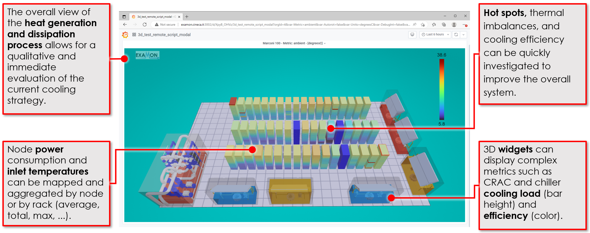
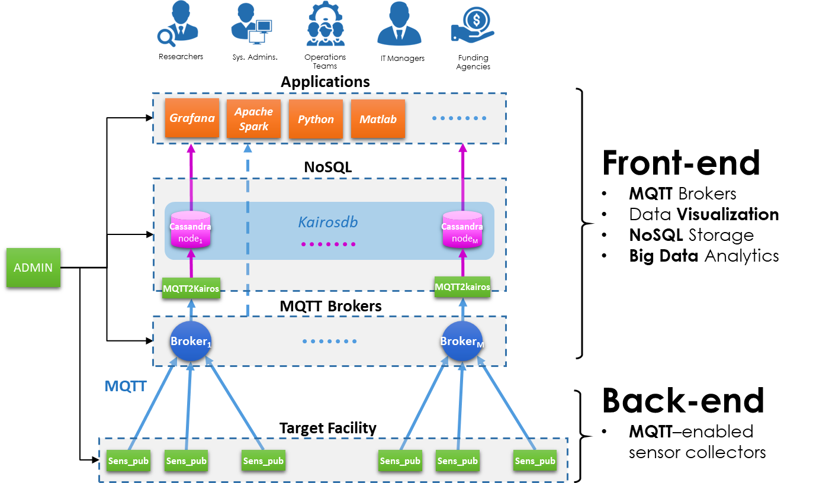

<figure markdown>
  { width="300" }
</figure>

ExaMon (Exascale Monitoring) is a data collection and analysis platform designed to manage large amounts of data. Its main prerogatives are to easily manage heterogeneous data, both in streaming and batch mode and to provide access to this data through a common interface. This simplifies the use of data to support applications such as real-time anomaly detection, predictive maintenance, and efficient resource and energy management leveraging machine learning and artificial intelligence techniques. Due to its scalable and distributed nature, it is easily applicable to HPC systems, especially exascale-sized ones, the primary use case for which it was designed.

The key feature of the framework is its data model, designed to be schema-less and scalable. In this way, it allows to collect a huge amount of heterogeneous data under a single interface. This data lake, which makes all the data available online to any user at any time, is proposed as a solution to break down internal data silos in organizations. The main benefit of this approach is that it enables capturing the full value of the data by making it immediately usable. In addition, having all the data in one place makes it easier to create complete and immediate executive reports, enabling faster and more informed decisions.

Another key aspect of the framework's design is making industry data easily available for research purposes. Indeed, researchers only need to manage a single data source to have a complete picture of complex industrial systems, and the benefits can be many. The ease of access to a huge variety and quantity of real-world data will enable them to create innovative solutions with results that may have real-world impact.

<figure markdown align="center">
  { width="80%" }
</figure>

Furthermore, access to a wide variety of heterogeneous data with very low latency enables the realization of accurate digital twins. In this regard, the framework can provide both historical data for building accurate models, and fresh data for quickly making inferences on the same models. Moreover, the availability of up-to-date data in near real-time allows the construction of visual models that enable the rapid acquisition of knowledge about the state of any complex system. In fact, by exploiting the language of visual communication, it is possible to extend collaboration by bringing together a wide range of experts focused on problem-solving or optimization of the system itself.

<figure markdown align="center">
  { width="80%" }
</figure>

The architecture of the framework is based on established protocols and technologies rather than specific tools and implementations. The communication layer is based on the publish-subscribe model that finds various implementations, such as in the MQTT protocol. The need to interact with different data sources, ranging from complex room cooling systems to internal CPU sensors, requires a simple, scalable, low-latency communication protocol that is resilient to network conditions and natively designed to enable machine-to-machine (M2M) communication in complex environments. Moreover, data persistence is handled by a NoSQL-type database, an industry-proven technology, designed to be horizontally scalable and built to efficiently handle large amounts of data. On top of these two pillars, the other components are primarily dedicated to handling the two main categories of data that characterize the ExaMon framework. The first is the time series data type, which represents the majority of the data sources managed by ExaMon and is suitable for managing all the sensors and logs available today in a data center. The second is the generic tabular data type, suitable for managing metadata and any other data that does not fall into the first category. ExaMon provides the tools and interfaces to coordinate these two categories and interface them with the user in the most seamless way.

As a data platform, one of ExaMon's priorities is data sharing. To maximize its effectiveness, it offers both domain-specific interfaces (DSLs), which allow more experienced users to take full advantage of the data source's capabilities, and more high-level, standard interfaces such as the ANSI SQL language. Again, ExaMon promotes tools that are state of the art for time series data visualization, such as Grafana. Although more experienced users can interface with ExaMon using tools such as Jupyter notebooks (via a dedicated client), more user-friendly BI solutions such as Apache Superset, which uses web visualization technologies and the ANSI SQL language, are also provided to streamline the user experience. There is also compatibility with tools such as Apache Spark and Dask for large-scale data analysis in both streaming and batch modes. Finally, CLI-type tools are also available to provide access to the data and typical features directly from the user's shell.