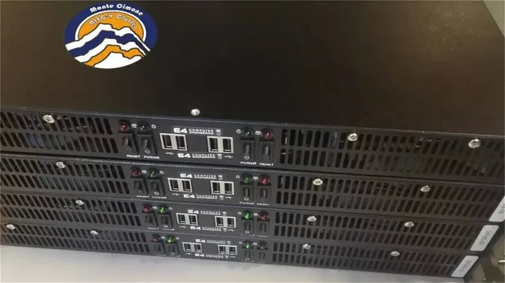

# Monte Cimone - UniBO

<figure markdown>
  { width="300" }
</figure>

## Configuration of the Monte Cimone RISC-V cluster:

- Manufacturer: E4
- Form factor: 1U
- Nodes: 8
- Blade configuration: Four blades with dual boards
- Motherboard: HiFive Unmatched developed by SiFive
- SoC: Freedom U740
- Cores: Four U74 cores at 1.4GHz and one S7 core with Mix+Match technology
- Cache: 2MB L2 cache
- Memory: 16GB DDR4-1866
- Storage: 1TB NVMe SSD

## Metrics

| Metric                | Description                          | Unit of Measurement |
|-----------------------|--------------------------------------|---------------------|
| CYCLES                | Number of cycles                     | cycles              |
| INSTRUCTIONS          | Number of instructions executed      | count               |
| dsk_total.read        | Total disk read operations           | operations          |
| dsk_total.writ        | Total disk write operations          | operations          |
| io_total.read         | Total input/output read operations   | operations          |
| io_total.writ         | Total input/output write operations  | operations          |
| load_avg.15m          | Load average over 15 minutes         | load average        |
| load_avg.1m           | Load average over 1 minute           | load average        |
| load_avg.5m           | Load average over 5 minutes          | load average        |
| memory_usage.buff     | Memory used for buffering            | bytes               |
| memory_usage.cach     | Memory used for caching              | bytes               |
| memory_usage.free     | Free memory available                | bytes               |
| memory_usage.used     | Memory currently in use              | bytes               |
| net_total.recv        | Total network data received          | bytes               |
| net_total.send        | Total network data sent              | bytes               |
| paging.in             | Paging operations in                 | operations          |
| paging.out            | Paging operations out                | operations          |
| procs.blk             | Number of processes blocked          | count               |
| procs.new             | Number of new processes              | count               |
| procs.run             | Number of running processes          | count               |
| system.csw            | Number of context switches           | count               |
| system.int            | Number of interrupts                 | count               |
| temperature.average   | Average system temperature           | Celsius             |
| temperature.cpu_temp  | CPU temperature                      | Celsius             |
| temperature.mb_temp   | Motherboard temperature              | Celsius             |
| temperature.nvme_temp | NVMe device temperature              | Celsius             |
| temperature.total     | Total system temperature             | Celsius             |
| total_cpu_usage.idl   | CPU idle time                        | percentage          |
| total_cpu_usage.stl   | CPU steal time                       | percentage          |
| total_cpu_usage.sys   | CPU system time                      | percentage          |
| total_cpu_usage.usr   | CPU user time                        | percentage          |
| total_cpu_usage.wai   | CPU wait time                        | percentage          |
